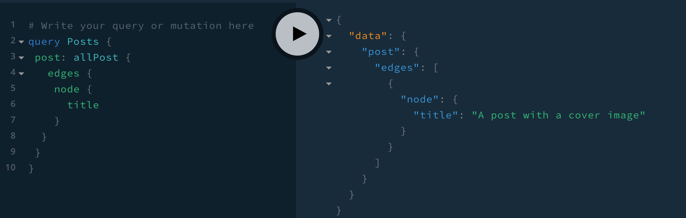

### Introduction
First of all lets understand about Gridsome.`what is Gridsome?` Grisome is [Jamstack](https://gridsome.org/docs/jamstack/) framework
to build static website and it is build on VueJs.

### How it works?
Source plugin which fetch the content from local file or get data from other API's and dump those data in local databse.
Gridsome uses [GraphQL](https://graphql.org/learn/) to fetch data which is required by VueJs componant or pages.

### Getting started
we need to install `gridsome-cli` locally or you can use `npx` to create simple blog project

if you are using npm then  `npm install -g @gridsome/cli` command or if you are using yarn then use
  `yarn global add @gridsome/cli` command to get installed `gridsome-cli`

or simply use npx to create simple project
```javascript
$ npx gridsome create 'simple-blog-project'
$ cd simple-blog-project
$ npm install
$ npm run develop
```
### Directory Structure and files
- `package.json` this file content the packages or plugins which have been used in project.
- `gridsome.server.js` this file is used for hooks in gridsome server and it is completely optional.
- `static`  Files which will be put inside this folder will be copied to `dist` directory after project build.
- `src/assets` This directory is used for images, css, fonts and icons files.
- `src/components` Used to VueJs compponent which are required in application.
- `src/layouts` Used for Layouts required in application.
- `src/pages` Used to create pages for application. It generates automatic `routes` based on file path.
- `src/templates` Templates are used to create single pages for nodes in a collection.

### Create your new blog

As we have gone through some basic command and directory structure of project.
Now it's time to create actual blog. we will use `markdown` as datasource to create the blog pages.

We will also use [`source-filesystem`](https://gridsome.org/plugins/@gridsome/source-filesystem) and
[`transformer-remark`](https://www.npmjs.com/package/@gridsome/transformer-remark) npm packages

```javascript
$ npm install --save-dev @gridsome/source-filesystem
$ npm install --save-dev @gridsome/transformer-remark
```

let's understands the uses of these two installed packages
`source-filesystem` This package tranforms your content which will be used by componants using `GraphQL`
`transformer-remark` This package is used to understand the `markdown` content by application.

now let's include these package in `gridsome.config.js`

```javascript
module.exports = {
  siteName: 'Gridsome',
  plugins: [
    {
      // Create posts from markdown files
      use: '@gridsome/source-filesystem',
      options: {
        typeName: 'Post',
        path: 'content/posts/*.md',
      }
    }
  ],
  transformers: {
    //Add markdown support to all file-system sources
    remark: {
      externalLinksTarget: '_blank',
      externalLinksRel: ['nofollow', 'noopener', 'noreferrer'],
      anchorClassName: 'icon icon-link',
    }
  }
}
```
options we used for `souce-filesystem` in above snippets
`typeName` this will be the node name in `GraphQL`.
`path` it will look in mentioned path and grab the `markdown` files. it will also create the `route` same as file name which will be used to access the blog content in browser.

let's create `my-first-blog.md` in `content/blogs` directory.
```
---
title: My first blog
date: 2019-01-07
---

Lorem Ipsum is simply dummy text of the printing and typesetting industry.
Lorem Ipsum has been the industry's standard dummy text ever since the 1500s,
when an unknown printer took a galley of type and scrambled it to make a type specimen book.
```

now to verify where every thing is working or not restart the server so that it load the blog data which we have created in above step.
and visit `http://localhost:8080/___explore` and try to execute the below query.



If everything is correct then it should return the `title` of post in graphql response.

### Create template for post

Now we will create template in `src/templates` directory with same as
we have declared `typeName` in `source-filesystem` config.

let's create `Post.vue` file in template directory.

```javascript
<template>
    <layout>
        <div v-text="$page.post.title" />
        <div v-html="$page.post.content" />
    </layout>
</template>

<page-query>
  query Post ($path: String) {
      post: post (path: $path) {
          title
          content
      }
  }
</page-query>
```

now what is `page-query`?, well it used to executing the `graphql` queries.

query result can be access in `$page` instance. for eg: `$page.post.title`
to access your blog just hit `http://localhost:8080/my-first-blog` in browser.

##### Congratulations!!! you have created your first demo blog.
gridsome have made it too simple to create blog site isn't it?

checkout some [gridsome starter](https://gridsome.org/starters/) themes, just
clone those repository and start writing the blog
